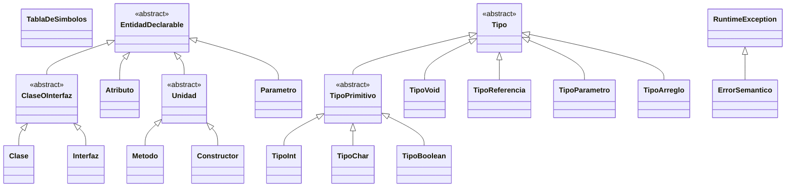

# Diagrama de clases del analizador semántico

```mermaid
classDiagram
    direction TB

    class TablaDeSimbolos
    class EntidadDeclarable {
        <<abstract>>
    }
    class ClaseOInterfaz {
        <<abstract>>
    }
    class Clase
    class Interfaz
    class Atributo
    class Unidad {
        <<abstract>>
    }
    class Metodo
    class Constructor
    class Parametro

    class Tipo {
        <<abstract>>
    }
    class TipoPrimitivo {
        <<abstract>>
    }
    class TipoInt
    class TipoChar
    class TipoBoolean
    class TipoVoid
    class TipoReferencia
    class TipoParametro
    class TipoArreglo

    class ErrorSemantico

    %% Herencia
    EntidadDeclarable <|-- ClaseOInterfaz
    EntidadDeclarable <|-- Atributo
    EntidadDeclarable <|-- Unidad
    EntidadDeclarable <|-- Parametro
    ClaseOInterfaz <|-- Clase
    ClaseOInterfaz <|-- Interfaz
    Unidad <|-- Metodo
    Unidad <|-- Constructor

    Tipo <|-- TipoPrimitivo
    Tipo <|-- TipoVoid
    Tipo <|-- TipoReferencia
    Tipo <|-- TipoParametro
    Tipo <|-- TipoArreglo
    TipoPrimitivo <|-- TipoInt
    TipoPrimitivo <|-- TipoChar
    TipoPrimitivo <|-- TipoBoolean

    RuntimeException <|-- ErrorSemantico
```
