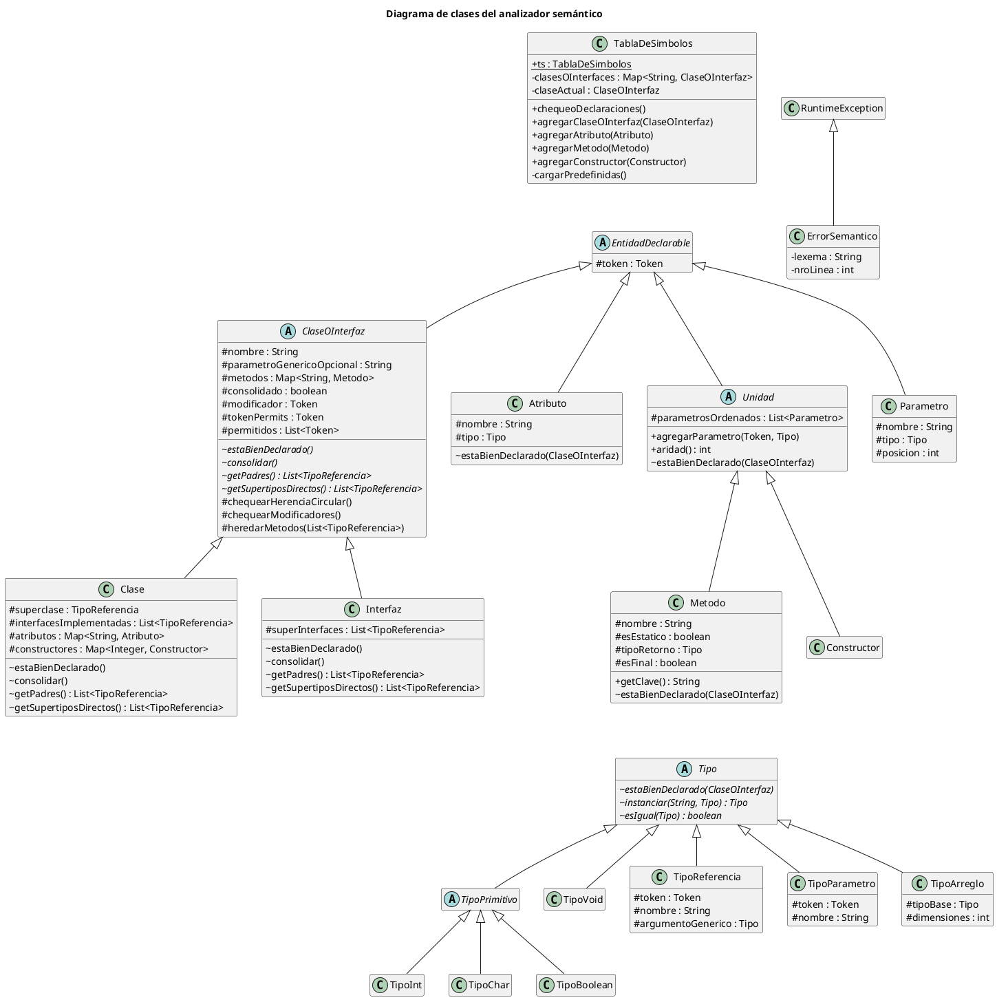

# Informe - Etapa 3

**Autor:** Nicolás Cid  
**Materia:** Compiladores e Intérpretes


---

# Diagrama de Clases de la Tabla de Símbolos

Este diagrama es una versión simplificada (no exhaustiva) del diagrama de clases, pensada para facilitar la comprensión
de la jerarquía de clases. Solo se incluye la información relevante al diseño del analizador semántico. Por ese motivo
se omitieron las flechas de dependencia, agregación, composición y asociación, que dificultan la lectura del gráfico:
las relaciones entre clases pueden deducirse a partir del tipo de los atributos de cada clase.

Notación de visibilidad utilizada:

- `+`: público.
- `-`: privado.
- `#`: protegido.
- `~`: visible solo dentro del paquete.

El ícono junto al nombre de cada clase indica su tipo:

- `C`: clase concreta.
- `A`: clase abstracta. Sus métodos abstractos se muestran en cursiva.

Los miembros subrayados son estáticos (e.g.: `ts` en `TablaDeSimbolos`).



# Instrucciones de Compilación y Uso

## Requisitos previos

- JDK 21 instalado
- No requiere tener Gradle instalado previamente (el proyecto incluye el Gradle Wrapper)

## Compilación

Desde la raíz del proyecto, ejecutar:

**Linux / macOS:**
​```
./gradlew jar
​```

**Windows:**
​```
gradlew.bat jar
​```

Esto genera el ejecutable en:
​```
build/libs/Compilador.jar
​```

## Uso

Una vez compilado, el compilador se invoca desde la línea de comandos pasando como parámetro el archivo fuente de
MiniJava. El comando es el mismo en Linux, macOS y Windows, ya que se ejecuta a través de `java`:

​```
java -jar build/libs/Compilador.jar programa1.java
​```

Donde `programa1.java` es el archivo fuente de MiniJava a compilar (se acepta cualquier extensión).

## Etapas anteriores

La clase Main siempre hará referencia a la etapa actual. Se mantienen los Mains de etapas anteriores, con nombres
descriptivos, en caso de que sea necesario recrear su ejecución (e.g.: MainEtapa1).

---

# Logros

### Etapa 2 (Usa MainEtapa2)

* Genericidad Avanzada E2
* Inicializacion de Arreglos E2 (corregido)
* Operador Ternario E2 (corregido)

### Etapa 3 (Usa Main)

* Entrega Anticipada E3
* Genericidad Avanzada E3
* Herencia Multiple E3
